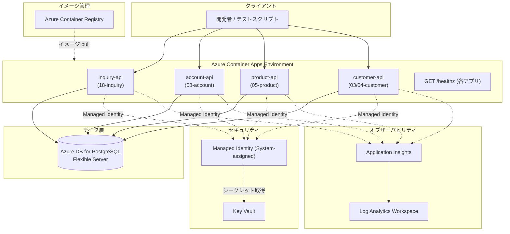
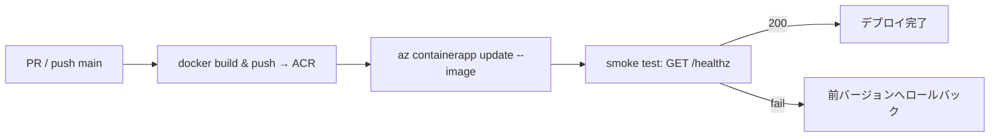

# Azureインフラ設計書

> **対象**: practice-bank モダナイゼーション 読み取りスライス4本
> **スコープ**: 18-inquiry / 08-account / 05-product / 03-customer / 04-customersearch
> **制約**: 最小構成・7時間タイムボックス。Service Bus / Event Grid / Durable Functions / APIM は今回対象外。

---

## 基本情報

| 項目 | 内容 |
|---|---|
| 担当 | Azure担当（あなた） |
| 作成日 | {YYYY-MM-DD} |
| ステータス | 起草 / レビュー中 / 確定 |
| リージョン | `{例: japaneast}` |
| リソースグループ | `{例: rg-practice-bank-dev}` |
| サブスクリプションID | `{subscription-id}` |

---

## 1. 全体構成図



---

## 2. Azureリソース一覧

| リソース種別 | リソース名 | SKU / ティア | 備考 |
|---|---|---|---|
| Resource Group | `rg-{env}-practice-bank` | — | |
| Container Registry | `acr{env}practicebank` | Basic | イメージプッシュ先 |
| Container Apps Env | `cae-{env}-practice-bank` | Consumption | 4スライス共通 |
| Container Apps (×4) | `ca-inquiry-api` 等 | Consumption | 後述 |
| PostgreSQL Flexible | `psql-{env}-practice-bank` | Burstable B1ms | 開発用最小 |
| Key Vault | `kv-{env}-practice-bank` | Standard | DB接続文字列格納 |
| App Insights | `ai-{env}-practice-bank` | — | LAWに接続 |
| Log Analytics WS | `law-{env}-practice-bank` | PerGB2018 | |

> `{env}` = `dev` / `stg` / `prod`

---

## 3. Container Apps 設定（スライスごと）

### 共通設定

| 項目 | 値 |
|---|---|
| イングレス | External（HTTPS） |
| ターゲットポート | 8080 |
| min replicas | 0（コスト削減） |
| max replicas | 3 |
| CPU | 0.25 vCPU |
| Memory | 0.5 Gi |

### スライス別設定

| Container App名 | イメージ | エンドポイントパス | 環境変数 |
|---|---|---|---|
| `ca-inquiry-api` | `{acr}.azurecr.io/inquiry-api:{tag}` | `/inquiries/*` | 後述 |
| `ca-account-api` | `{acr}.azurecr.io/account-api:{tag}` | `/accounts/*` | 後述 |
| `ca-product-api` | `{acr}.azurecr.io/product-api:{tag}` | `/products/*` | 後述 |
| `ca-customer-api` | `{acr}.azurecr.io/customer-api:{tag}` | `/customers/*` | 後述 |

### 環境変数 / シークレット

| 変数名 | 取得元 | Key Vaultシークレット名 | 説明 |
|---|---|---|---|
| `ConnectionStrings__Db` | Key Vault参照 | `db-connection-string` | PostgreSQL接続文字列 |
| `ApplicationInsights__ConnectionString` | Key Vault参照 | `appinsights-connection-string` | テレメトリ送信先 |
| `ASPNETCORE_ENVIRONMENT` | 直接設定 | — | `Production` |

---

## 4. PostgreSQL設計

### 4.1 サーバ設定

| 項目 | 値 |
|---|---|
| SKU | Burstable B1ms（開発）/ General Purpose 2vCores（本番） |
| PostgreSQL バージョン | 15 |
| 認証 | Microsoft Entra ID + PostgreSQL認証 |
| SSL | 必須 (`sslmode=require`) |
| バックアップ保持 | 7日 |

### 4.2 接続文字列フォーマット

```
Host={psql-host};Port=5432;Database={dbname};Username={user};Password={pass};Ssl Mode=Require;
```

Key Vault シークレット `db-connection-string` に格納。

### 4.3 マイグレーション

Flyway V1〜V7 を適用済みであること（`db/migration/` 参照）。
初回デプロイ時に以下を実行:

```bash
flyway -url="jdbc:postgresql://{host}:5432/{db}" \
       -user={user} -password={pass} \
       -locations=filesystem:db/migration migrate
```

### 4.4 権限設計

| ロール | 対象 | 権限 |
|---|---|---|
| `app_reader` | 読み取りスライス用アカウント | SELECT のみ |
| `app_writer` | 記帳系（今回スコープ外） | INSERT/UPDATE/DELETE |

```sql
-- 読み取り専用ロール作成（V4__system_grants.sql を参考に追加）
CREATE ROLE app_reader;
GRANT SELECT ON accounts, customers, products, branches,
               calendar, interest_rates, fee_schedules TO app_reader;
```

---

## 5. Key Vault設計

### 5.1 シークレット一覧

| シークレット名 | 内容 | ローテーション |
|---|---|---|
| `db-connection-string` | PostgreSQL接続文字列 | 手動（初期） |
| `appinsights-connection-string` | App Insights接続文字列 | 不要 |

### 5.2 アクセスポリシー

| プリンシパル | 操作 |
|---|---|
| Container Apps Managed Identity | Secret: Get |
| 開発者（AADグループ） | Secret: Get / List / Set |

---

## 6. セキュリティ設計

### 6.1 Managed Identity

各 Container App にシステム割り当てマネージドIDを有効化し、Key Vault の `Key Vault Secrets User` ロールを付与。
**接続文字列をイメージやenv-varに直書きしない。**

### 6.2 ネットワーク

| 通信 | 経路 | 備考 |
|---|---|---|
| クライアント → Container Apps | HTTPS (443) | TLS終端はContainer Apps |
| Container Apps → PostgreSQL | VNet統合 または サービスエンドポイント | 本番ではVNet推奨 |
| Container Apps → Key Vault | サービスエンドポイント / Private Endpoint | 本番ではPrivate推奨 |

### 6.3 OWASP対策（最低限）

| リスク | 対策 |
|---|---|
| SQLインジェクション | パラメータ化クエリ（Npgsql） |
| 機密情報漏えい | 接続文字列はKey Vault参照。ログに機密値を出力しない |
| 入力バリデーション | エンドポイントレベルで正規表現・桁数チェック。COBOLステータス08相当 |

---

## 7. CI/CDパイプライン概要



### 7.1 GitHub Actions ジョブ骨子

```yaml
jobs:
  build-and-deploy:
    steps:
      - uses: actions/checkout@v4
      - uses: azure/login@v2
        with: { creds: ${{ secrets.AZURE_CREDENTIALS }} }
      - run: |
          az acr build \
            --registry $ACR_NAME \
            --image {slice}-api:${{ github.sha }} \
            --file {Dockerfile path} .
      - run: |
          az containerapp update \
            --name ca-{slice}-api \
            --resource-group $RG \
            --image $ACR_NAME.azurecr.io/{slice}-api:${{ github.sha }}
```

---

## 8. 観測性（App Insights）

| テレメトリ種別 | 設定 |
|---|---|
| リクエストトレース | ASP.NET Core 自動計装 |
| 依存関係（DB） | Npgsql Activity Source |
| カスタムメトリクス | なし（初期） |
| アラート | 5xx エラー率 > 1% で通知 |

---

## 9. デプロイ手順（初回）

```bash
# 1. リソースグループ作成
az group create -n $RG -l japaneast

# 2. Container Registry
az acr create -n $ACR_NAME -g $RG --sku Basic --admin-enabled false

# 3. Log Analytics + App Insights
LAW_ID=$(az monitor log-analytics workspace create \
  -n law-dev-practice-bank -g $RG --query id -o tsv)
az monitor app-insights component create \
  -n ai-dev-practice-bank -g $RG \
  --workspace $LAW_ID --query connectionString -o tsv

# 4. Key Vault
az keyvault create -n $KV_NAME -g $RG \
  --enable-rbac-authorization true

# 5. PostgreSQL Flexible Server
az postgres flexible-server create \
  -n $PSQL_NAME -g $RG \
  --tier Burstable --sku-name Standard_B1ms \
  --version 15 \
  --admin-user {admin} --admin-password {pass} \
  --public-access 0.0.0.0  # 開発のみ; 本番はVNet設定

# 6. Flyway マイグレーション実行
# (ローカルから or Docker で)

# 7. Container Apps Environment
az containerapp env create \
  -n $CAE_NAME -g $RG \
  --logs-workspace-id $LAW_ID

# 8. 歩く骨格（空アプリ）デプロイで経路実証
az containerapp create \
  -n ca-account-api -g $RG \
  --environment $CAE_NAME \
  --image mcr.microsoft.com/dotnet/samples:aspnetapp \
  --target-port 8080 --ingress external \
  --min-replicas 0

# 9. 本物イメージに差し替え
az acr build --registry $ACR_NAME --image account-api:v1 \
  --file src/AccountApi/Dockerfile .
az containerapp update \
  -n ca-account-api -g $RG \
  --image $ACR_NAME.azurecr.io/account-api:v1
```

---

## 10. 公開エンドポイント確認

| Container App | エンドポイントURL | ヘルスチェック |
|---|---|---|
| inquiry-api | `https://{fqdn}/healthz` | [ ] 確認済み |
| account-api | `https://{fqdn}/healthz` | [ ] 確認済み |
| product-api | `https://{fqdn}/healthz` | [ ] 確認済み |
| customer-api | `https://{fqdn}/healthz` | [ ] 確認済み |

---

## 11. コスト見積もり（開発環境・概算）

| リソース | 見積もり/月 |
|---|---|
| Container Apps (Consumption, min=0) | ~0円（アイドル時） |
| PostgreSQL B1ms | ~4,000円 |
| Key Vault Standard | ~300円 |
| App Insights | ~0円（無料枠5GB/月内） |
| ACR Basic | ~500円 |
| **合計** | **~5,000円/月** |

---

*テンプレートバージョン: 1.0 / 参照: doc/work/modernization-brief.md § 4, 8, 10*
