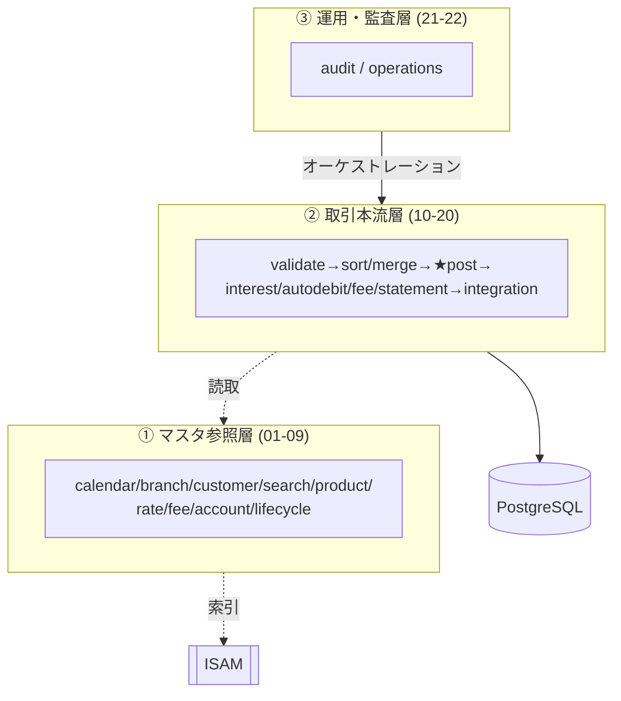

# AS-IS 機能仕様書 — システム概要・共通規約

> practice-bank 勘定系バッチシステム（COBOL）の現行（AS-IS）仕様書。
> 本書はシステム全体の概要と全サブシステム共通の規約を定義する。各機能の詳細は機能別仕様書を参照。

## 関連文書

| 文書 | 範囲 |
|---|---|
| 本書 (00) | システム概要・ドメインモデル・共通規約 |
| [01-master-reference.md](01-master-reference.md) | マスタ参照系（サブシステム 01〜09） |
| [02-transaction-pipeline.md](02-transaction-pipeline.md) | 取引パイプライン（サブシステム 10〜20） |
| [03-operations-audit.md](03-operations-audit.md) | 運用・監査（サブシステム 21〜22） |
| [04-shared-infrastructure.md](04-shared-infrastructure.md) | 共有ユーティリティ・DBスキーマ・スケジューラ・シード |

---

## 1. システム概要

架空のリテール銀行「practice-bank」の**勘定系バッチシステム**。

| 項目 | 内容 |
|---|---|
| 言語 | GnuCOBOL（埋め込みSQLは OCESQL） |
| DB | PostgreSQL 15（取引系） |
| マスタ | ISAM 索引ファイル（`.idx`）+ シード（`.dat`） |
| メッセージング | RabbitMQ（キュー `pb.events`） |
| スキーマ管理 | Flyway（V1〜V7、[db/migration/](../../../db/migration/)） |
| 定期実行 | systemd timer（[systemd/](../../../systemd/)） |
| 構成 | 22サブシステム + 共有ユーティリティ |

### ファイル種別

| 拡張子 | 種別 |
|---|---|
| `.cob` | 純COBOL（ISAM・ファイル処理系） |
| `.sqb` | 埋め込みSQL（OCESQL前処理対象、PostgreSQL系） |
| `.cpy` | コピーブック（レコード定義・API契約） |
| `.dat` | シードデータ（行順次） |
| `.idx` | ISAM索引ファイル |

### 3層アーキテクチャ

---

## 2. ドメインモデル

### 2.1 マスタ系エンティティ

| エンティティ | ISAMファイル | PGテーブル | 主キー |
|---|---|---|---|
| 顧客 customer | customer.idx | customers | 顧客ID(10) |
| 口座 account | account.idx | accounts | 口座番号(13) |
| 支店 branch | branch.idx | branches | 支店コード(3) |
| 商品 product | product.idx | products | 商品コード(3) |
| カレンダー calendar | calendar.idx | calendar | 日付(8) |
| 金利 interestrate | interestrate.idx | interest_rates | 商品+tier+適用日 |
| 手数料 feeschedule | feeschedule.idx | fee_schedules | 区分+tier+適用日 |

### 2.2 取引系エンティティ（PostgreSQL）

| テーブル | 役割 |
|---|---|
| `transactions` | 取引マスタログ |
| `postings` | 複式簿記の借方・貸方明細 |
| `balances` | 口座現在残高 |
| `interest_accruals` | 日次利息計算 |
| `autodebit_schedules` | 口座振替の定期指図 |
| `batch_run` | バッチ実行メタデータ |
| `audit_log` | 監査ログ（月次パーティション） |
| `audit_outbox` | トランザクショナル・アウトボックス |

詳細なカラム定義は [04-shared-infrastructure.md](04-shared-infrastructure.md) § DBスキーマを参照。

### 2.3 口座番号の構造

13桁 = 支店コード(3) + 商品コード(3) + 連番(7)。
採番ロジック: [subsystems/09-accountlifecycle/src/alc-open.cob](../../../subsystems/09-accountlifecycle/src/alc-open.cob)（連番は 9000000 から探索）。

---

## 3. 共通区分コード

### 3.1 取引区分（category）

| コード | 意味 | 借方/貸方の扱い（12-txnpost） |
|---|---|---|
| `10` | 入金 deposit | DR=現金勘定 / CR=顧客口座 |
| `20` | 出金 withdraw | DR=顧客口座 / CR=現金勘定 |
| `30` | 振替 transfer | DR=送金元 / CR=送金先 |
| `40` | 仕向送金 remittance/wire | DR=顧客口座 / CR=決済勘定 |
| `50` | 利息 interest | DR=決済勘定 / CR=顧客口座 |
| `60` | 手数料 fee | DR=顧客口座 / CR=手数料収益勘定 |

定義: [shared/copy/ws-txn-decoded-record.cpy](../../../shared/copy/ws-txn-decoded-record.cpy)（88条件 `TDD-CAT-DEPOSIT` 等）、検証は [shared/copy/double-entry-helper-procs.cpy](../../../shared/copy/double-entry-helper-procs.cpy)。

### 3.2 口座状態コード（acct_status）

| コード | 意味 |
|---|---|
| `P` | 申込中 Application/Pending |
| `A` | 有効 Active |
| `D` | 休眠 Dormant |
| `S` | 停止 Suspended |
| `C` | 解約 Closed |
| `R` | 再活性中 Reactivating |

定義: [subsystems/08-account/copy/api/acct-api.cpy](../../../subsystems/08-account/copy/api/acct-api.cpy)（88条件 `ACCT-ST-*`）。

### 3.3 取引ステータス（transactions.status）

| コード | 意味 |
|---|---|
| `PT` | 記帳済（未確定）Posted |
| `SE` | 確定 Settled |
| `RV` | 取消 Reversed |

定義: [db/migration/V1__initial_schema.sql](../../../db/migration/V1__initial_schema.sql)（`txn_status_enum`）。

### 3.4 システム勘定（GL）

| 勘定番号 | 用途 |
|---|---|
| `0010010000001` | 現金勘定 cash |
| `0010010000002` | 決済勘定 clearing |
| `0010010000003` | 利息費用勘定 interest expense |

ブートストラップ: [subsystems/22-operations/src/ops-seed-system-isam.cob](../../../subsystems/22-operations/src/ops-seed-system-isam.cob)。

### 3.5 通貨・金額

通貨は **JPY固定**、金額は**整数（円）**。`transactions.currency` に `CHECK (currency = 'JPY')` 制約あり（[db/migration/V1__initial_schema.sql](../../../db/migration/V1__initial_schema.sql)）。

---

## 4. 共通ステータス／戻り値規約

### 4.1 API戻り値コード（2桁）

ほぼ全サブシステムのAPI契約で共通。定義は各 `copy/api/*.cpy` の 88条件。

| コード | 意味 | 典型的なHTTP対応（モダナイゼーション時） |
|---|---|---|
| `00` | 正常 OK | 200 |
| `02` | 警告（重複検知等） | 200 |
| `04` | 該当なし / 部分却下 | 404 / 207 |
| `08` | 入力不正 Invalid | 400 |
| `10` | EOF（反復取得の終端） | 200（空） |
| `12` | I/O失敗 | 500 |
| `16` | 致命的 Fatal | 500 |

### 4.2 内部リターンコード

定義: [shared/copy/ws-codes.cpy](../../../shared/copy/ws-codes.cpy)

| 名前 | 値 | 意味 |
|---|---|---|
| `WS-RC-OK` | 0 | 正常 |
| `WS-RC-WARN` | 4 | 警告 |
| `WS-RC-RECOVERABLE` | 8 | 回復可能 |
| `WS-RC-OPERATOR` | 12 | オペレータ介入要 |
| `WS-RC-FATAL` | 16 | 致命的 |

ファイルステータス: `WS-FS-OK="00"` / `WS-FS-EOF="10"` / `WS-FS-DUP-KEY="22"` / `WS-FS-NOT-FOUND="23"`。

---

## 5. 設計上の堅牢化（横断的関心事）

| 機能 | 内容 | 主要コード |
|---|---|---|
| トランザクショナル・アウトボックス | 記帳と同一Txで監査intentを `audit_outbox` に書き、`aud-drain` が冪等転送 | [shared/util/aud-drain/](../../../shared/util/aud-drain/)、[db/migration/V7__audit_outbox.sql](../../../db/migration/V7__audit_outbox.sql) |
| 冪等性 | `event_key` で重複排除 | [db/migration/V6__audit_event_key.sql](../../../db/migration/V6__audit_event_key.sql) |
| チェックポイント/リカバリ | バッチ再開のための進捗保存 | [subsystems/10-txnvalidate/src/txval-checkpoint-recover.cob](../../../subsystems/10-txnvalidate/src/txval-checkpoint-recover.cob) |
| シリアライズ・リトライ | 直列化競合時の指数バックオフ再試行FSM | [shared/copy/ser-retry-procs.cpy](../../../shared/copy/ser-retry-procs.cpy) |
| 二重起動防止 | `flock` によるバッチ排他 | [subsystems/22-operations/src/ops-batch-daily.sqb](../../../subsystems/22-operations/src/ops-batch-daily.sqb) |
| 休眠ライフサイクル | 口座の休眠/再活性スキャン | [subsystems/09-accountlifecycle/src/alc-dormancy-scan.cob](../../../subsystems/09-accountlifecycle/src/alc-dormancy-scan.cob) |
| 監査パーティショニング | 監査ログの月次レンジパーティション | [db/migration/V3__audit_log_partitioning.sql](../../../db/migration/V3__audit_log_partitioning.sql) |

---

## 6. 主要不変条件（インバリアント）

12-txnpost で強制される記帳の不変条件。詳細は [02-transaction-pipeline.md](02-transaction-pipeline.md) § 12 を参照。

| ID | 不変条件 | 強制方法 |
|---|---|---|
| I1 | 冪等性: txn_id は一意 | UNIQUE制約 + INSERT前SELECT |
| I3 | 残高: 借方後の残高 ≥ -当座貸越枠 | 記帳前バランスチェック |
| I4 | 単調性: business_date ≥ 完了済バッチ最大日 | 起動時チェック |
| I5 | 禁止操作: 解約/停止口座への借方禁止 | 口座状態チェック |
| — | 借方合計 = 貸方合計 | 2明細ペア + CHECK制約 |
