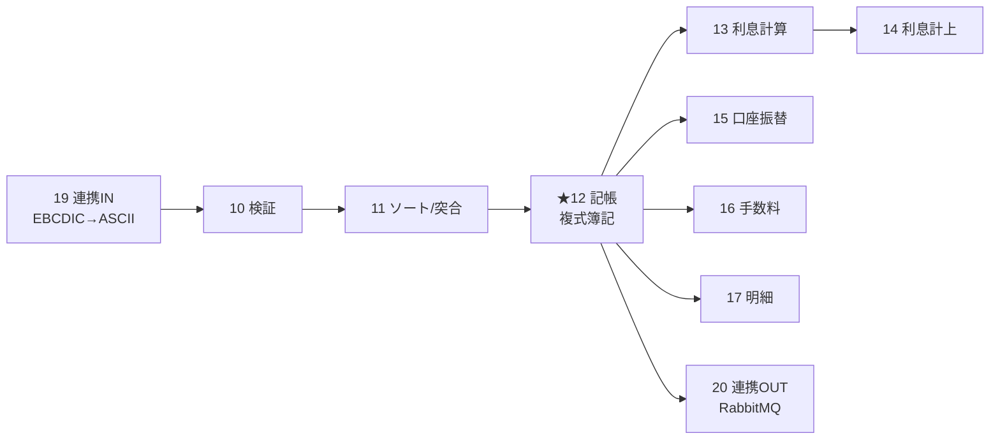

# AS-IS 機能仕様書 — 取引パイプライン（サブシステム 10〜20）

> EBCDIC連携入力から検証・ソート・**複式簿記記帳**・利息/振替/手数料・明細・連携出力までの取引本流。中核は **12-txnpost**（記帳）。
> 共通規約・区分コード・不変条件は [00-overview.md](00-overview.md) を参照。

## パイプライン全体像

ファイル受け渡し: decoded → valid → sorted → ready → (DB記帳)。各段は中間ファイル名を Linkage で受け取る。

## 目次

| # | サブシステム | 主プログラム | データ |
|---|---|---|---|
| 10 | txnvalidate | TXVAL-VALIDATE-BATCH | ファイル |
| 11 | txnsortmerge | TXSM-SORT-BATCH / MERGE | ファイル |
| 12 | **txnpost** | **TXPOST-RUN-BATCH / REVERSE** | **PostgreSQL** |
| 13 | interestaccrual | IACR-RUN-DAILY | PostgreSQL |
| 14 | interestpost | IPST-RUN-MONTHEND | PostgreSQL |
| 15 | autodebit | AD-RUN-DAILY | PostgreSQL |
| 16 | fee | FEE-CHARGE | PostgreSQL |
| 17 | statement | STMT-GENERATE-BATCH | PostgreSQL→出力 |
| 18 | inquiry | INQ-MAIN | PostgreSQL（読取） |
| 19 | integrationin | INTI-DECODE-BATCH | ファイル |
| 20 | integrationout | INTO-PUBLISH-EVENT / DRAIN | RabbitMQ |

---

## 10-txnvalidate — 取引検証

API契約: [copy/api/tx-val-api.cpy](../../../subsystems/10-txnvalidate/copy/api/tx-val-api.cpy)

### プログラム

| Program-ID | ファイル | 機能 |
|---|---|---|
| `TXVAL-VALIDATE-BATCH` | [src/txval-validate-batch.cob](../../../subsystems/10-txnvalidate/src/txval-validate-batch.cob) | デコード済取引の検証（マスタキャッシュ照合・コントロールトータル・チェックポイント） |
| `TXVAL-CHECKPOINT-RECOVER` | [src/txval-checkpoint-recover.cob](../../../subsystems/10-txnvalidate/src/txval-checkpoint-recover.cob) | チェックポイントからの再開（`TC-SENTINEL="OK"`検証、`TC-LAST-SEQ`抽出） |
| `TXVAL-REPORT-SUMMARY` | [src/txval-report-summary.cob](../../../subsystems/10-txnvalidate/src/txval-report-summary.cob) | サマリレポート |

### 主要ロジック（M-START）

init → マスタキャッシュ（支店/商品/カレンダー）ロード → 取引毎検証 → チェックポイント書込 → レポート。

### 入出力

- 入力 `TXVAL-BATCH-INPUT`: `TXVAL-IN-BATCH-ID`(X(14))、`TXVAL-IN-BUSINESS-DATE`(9(8))、入力/valid/error/checkpoint の各ファイル名(X(80))
- 出力 `TXVAL-BATCH-OUTPUT`: カウンタ `TXVAL-OUT-PROCESSED`/`VALIDATED`/`REJECTED`、却下コード別カウンタ `TXVAL-OUT-PRI-E001`〜`E099`・`TXVAL-OUT-OCC-E001`〜`E099`
- 戻り値: `00`=OK / `04`=一部却下 / `08`=入力不正 / `12`=I/O / `16`=致命的

### チェックポイント回復

`TXVAL-CR-STATUS`: `00`=発見 / `04`=チェックポイント無し（新規開始） / `12`=破損 / `16`=致命的。`TXVAL-CR-OUT-LAST-SEQ`(9(10)) で再開位置を返す。

---

## 11-txnsortmerge — ソート・突合

API契約: [copy/api/tx-sm-api.cpy](../../../subsystems/11-txnsortmerge/copy/api/tx-sm-api.cpy)

### プログラム

| Program-ID | ファイル | 機能 |
|---|---|---|
| `TXSM-SORT-BATCH` | [src/txsm-sort-batch.cob](../../../subsystems/11-txnsortmerge/src/txsm-sort-batch.cob) | 検証済取引を `WSP-SEQ` でソート（無損失検証） |
| `TXSM-MERGE-BATCH` | [src/txsm-merge-batch.cob](../../../subsystems/11-txnsortmerge/src/txsm-merge-batch.cob) | 前日突合（recon）・重複/ソート順違反検出 |
| `TXSM-REPORT-SUMMARY` | [src/txsm-report-summary.cob](../../../subsystems/11-txnsortmerge/src/txsm-report-summary.cob) | サマリ |

### 主要ロジック（SORT: MAIN-LOGIC）

`INIT-OUTPUT-AREA` → `EXECUTE-SORT`（`SORT-WORK-FILE`、キー=`WSP-SEQ`）→ `VERIFY-LOSSLESS-INVARIANT`（入力件数=出力件数）→ `PUBLISH-COUNTERS` → `EMIT-AUDIT-SUMMARY`。

### 入出力（主なもの）

- SORT 出力 `TXSM-SORT-OUTPUT`: `TXSM-SO-STATUS`、`TXSM-SO-RECORDS-PROCESSED`/`SORTED`(9(7))、`TXSM-SO-CTRL-TOTAL-MATCH`(X(1))、`TXSM-SO-AMOUNT-SUM`(9(20))
- MERGE 出力 `TXSM-MERGE-OUTPUT`: `TXSM-MO-RECORDS-SORTED-IN`/`RECON-IN`/`MERGED-OUT`、`TXSM-MO-DUPLICATE-RECORDS`/`PAIRS`、`TXSM-MO-SORT-VIOLATIONS`、`TXSM-MO-RECON-PRESENT-FLAG`(X(1))

### 不変条件

無損失（件数保存）・コントロールトータル一致（金額合計保存）・重複検出（冪等性違反/再投入検知）。

戻り値（共通）: `00`/`04`/`08`/`12`/`16`

---

## 12-txnpost — 複式簿記記帳（★中核）

API契約: [copy/api/tx-post-api.cpy](../../../subsystems/12-txnpost/copy/api/tx-post-api.cpy)
> **記帳系は不変条件を壊すリスクが高くモダナイゼーション対象外（読取スライスのみ切り出す）。** 本節は AS-IS 仕様の保全を目的とする。

### プログラム

| Program-ID | ファイル | 機能 |
|---|---|---|
| `TXPOST-RUN-BATCH` | [src/txpost-run-batch.sqb](../../../subsystems/12-txnpost/src/txpost-run-batch.sqb) | ready取引を複式簿記で記帳・残高更新 |
| `TXPOST-REVERSE` | [src/txpost-reverse.sqb](../../../subsystems/12-txnpost/src/txpost-reverse.sqb) | 既記帳取引の取消（借方/貸方反転） |
| `TXPOST-REPORT-SUMMARY` | [src/txpost-report-summary.cob](../../../subsystems/12-txnpost/src/txpost-report-summary.cob) | サマリ・保存則検証 |

### 起動シーケンス（M-START）

[src/txpost-run-batch.sqb](../../../subsystems/12-txnpost/src/txpost-run-batch.sqb)

1. `INIT-OUTPUT-AREA`
2. `INIT-SER-CONFIG`（環境変数 `TXPOST_MAX_RETRIES`/`TXPOST_BACKOFF_MS`/`TXPOST_FAULT_CONFLICT_N`）
3. `COPY-PATHS-FROM-LINKAGE`
4. `DB-CONNECT`（PostgreSQL）
5. `DRAIN-AUDIT-OUTBOX`（保留監査intentの処理）
6. `VERIFY-SYSTEM-ACCOUNTS`（現金=0010010000001 / 決済=0010010000002 の存在確認）
7. `CHECK-I4-MONOTONICITY`（業務日 ≥ 完了済バッチ最大業務日）
8. `OPEN-FILES`（ready入力 / error / recon-defer / dormancy-repair）
9. `PROCESS-LOOP`（H/D/T レコード判定、`HANDLE-DETAIL`）
10. `CLOSE-FINAL-BLOCK` → `PUBLISH-COUNTERS` → `SET-FINAL-STATUS` → `EMIT-SUMMARY-AUDIT` → `DRAIN-AUDIT-OUTBOX` → `DB-DISCONNECT`

### 取引毎検証（PROCESS-TXN-WITHIN-BLOCK）

| 検査 | PARAGRAPH | 内容 |
|---|---|---|
| I1 冪等性 | `CHECK-I1-IDEMPOTENCY` | `SELECT 1 FROM transactions WHERE txn_id=:HV-TXN-ID`。SQLCODE=0→重複スキップ、=100→新規、その他→defer |
| I5 禁止操作 | `CHECK-I5-FORBIDDEN-OPS` | 状態 `P`→E023 / `C`→E005 / `S`→E006 / `D`→入金のみ許可・出金等拒否(E022) |
| 振替宛先 | `CHECK-CAT-30-PAYEE` | category=30 の宛先口座の存在・有効性 |
| I3 残高 | `CHECK-I3-BALANCE` | category 20/30/40 で残高-金額 < -当座貸越枠 なら E021 |

### 借方/貸方の決定（POST-TXN-PAIR-ATTEMPT）

| category | 借方 DR | 貸方 CR |
|---|---|---|
| 10 入金 | 現金勘定 | 顧客口座(payer) |
| 20 出金 | 顧客口座(payer) | 現金勘定 |
| 30 振替 | 送金元(payer) | 送金先(payee) |
| 40 仕向送金 | 顧客口座(payer) | 決済勘定 |

### 記帳トランザクション（SERIALIZABLE）

1. `SET TRANSACTION ISOLATION LEVEL SERIALIZABLE`
2. `balances` を `FOR UPDATE` でロック（`WS-LOCK-ACCT-1`/`WS-LOCK-ACCT-2` の順序でデッドロック回避）
3. `INSERT INTO transactions (... status='PT' ...)`
4. `INSERT INTO postings`（明細1: posting_id=txn_id||"01", DR）
5. `INSERT INTO postings`（明細2: posting_id=txn_id||"02", CR）
6. `UPDATE balances`（DR口座 -金額、`SQLERRD(3)=1` 検証）
7. `UPDATE balances`（CR口座 +金額、`SQLERRD(3)=1` 検証）
8. `BUILD-PER-TXN-AUDIT`
9. `INSERT-OUTBOX-INTENT`（`audit_outbox` へ、`event_key`=MD5(txn_id||posting_id)）

### シリアライズ・リトライFSM（POST-TXN-PAIR-PARA）

状態 `WS-ATTEMPT-RESULT`: `OK`/`DEFER`/`FATAL`/`INDOUBT`/`CONFLICT`。`CLASSIFY-SQL-RESULT`（[shared/copy/ser-retry-procs.cpy](../../../shared/copy/ser-retry-procs.cpy)）で SQLCODE/SQLSTATE を分類:

| SQLSTATE/CODE | 結果 | 動作 |
|---|---|---|
| SQLCODE=0 | OK | コミット |
| `40001`/`40P01`（直列化/デッドロック） | CONFLICT | リトライ（指数バックオフ+ジッタ） |
| ロックタイムアウト | DEFER | recon-defer ファイルへ |
| 重複キー(-805相当) | INDOUBT | `COMMIT-IN-DOUBT-RESOLVE`（4行存在確認で冪等成功扱い） |
| その他 | FATAL | E025 |

バックオフ: `MIN(base*2^retry, cap) + jitter`（既定 base=10ms / cap=2000ms / max=5回）。

### エラーコード

| コード | 意味 | リトライ |
|---|---|---|
| E004 | 口座なし | 不可（hard reject） |
| E005 | 口座解約済 | 不可 |
| E006 | 口座停止 | 不可 |
| E020 | 業務日の遡及（I4違反） | 不可 |
| E021 | 残高不足（I3違反） | 不可 |
| E022 | 休眠口座への禁止操作 | 不可 |
| E023 | 申込中状態（I5） | 不可 |
| E024 | txn_id重複（I1） | 不可（スキップ） |
| E025 | システム勘定欠落/致命的DB | 不可 |

### 取消（TXPOST-REVERSE）

[src/txpost-reverse.sqb](../../../subsystems/12-txnpost/src/txpost-reverse.sqb)

1. `VALIDATE-INPUT`（`TXPV-ORIG-TXN-ID`/`REASON`/`OPERATOR-ID`）
2. `SELECT-ORIG-TXN` → `CHECK-ORIG-STATUS`（status='PT'、未取消を検証）
3. `DETERMINE-RV-ACCTS`（借方/貸方を反転）
4. `POST-RV-PARA`（反転ペアを記帳、リトライFSM共用）

DB制約: `txn_reversal_pair`（status='RV' ⟺ reversal_of IS NOT NULL）、`uq_txn_reversal_of_when_rv`（1取引につき取消は1回のみ）。

### API出力カウンタ（TXPOST-RUN-OUTPUT）

`TXPR-RECORDS-READ`/`ATTEMPTED`/`POSTED`、`TXPR-ALREADY-POSTED-SKIPPED`、`TXPR-HARD-REJECTED`、`TXPR-RECON-DEFERRED`、`TXPR-IN-DOUBT-RESOLVED`、`TXPR-DORMANCY-DEFERRED`、エラー別 `TXPR-REASON-E004`〜`E026`、`TXPR-DURATION-SEC`。
戻り値 `TXPR-STATUS`: `00`=OK / `04`=一部defer / `08`/`12`/`16`。

### テスト

[tests/unit/](../../../subsystems/12-txnpost/tests/unit/): `txpost-test.cob`、`check-postings-sum.sh`（借方=貸方）、`check-balance.sh`（残高整合）、`check-row-count.sh`（重複なし）、`seed-*.sh`。

---

## 13-interestaccrual — 日次利息計算

API契約: [copy/api/iacr-api.cpy](../../../subsystems/13-interestaccrual/copy/api/iacr-api.cpy)

### プログラム

| Program-ID | ファイル | 機能 |
|---|---|---|
| `IACR-RUN-DAILY` | [src/iacr-run-daily.sqb](../../../subsystems/13-interestaccrual/src/iacr-run-daily.sqb) | 全口座の日次利息を計算し `interest_accruals` に `status='AC'` で挿入 |
| `IACR-REPORT-SUMMARY` | [src/iacr-report-summary.cob](../../../subsystems/13-interestaccrual/src/iacr-report-summary.cob) | サマリ・保存則検証 |

### 主要ロジック

`balances` をカーソル走査 → 適格性判定（有効状態・残高>0・利息対象商品）→ 金利参照（irate-api）→ `accrued = balance × rate × days / 36500` → `INSERT INTO interest_accruals`。

### 不適格カウンタ

`WS-CTR-INELIG-STATE`（非有効）/`-PROD`（利息なし商品）/`-BAL`（残高≤0）/`-RATE`（金利参照失敗）/`WS-CTR-ALREADY`（当日計算済）。

### 入出力・戻り値

- 入力: `IACR-RUN-BATCH-ID`、`IACR-RUN-BUSINESS-DATE`、summary/checkpoint ファイル名
- 出力: `IACR-OUT-ACCOUNTS-SCANNED`、`ACCRUALS-INSERTED`、`INELIGIBLE-STATE/PROD/BALANCE/RATE`、`ALREADY-ACCRUED`、`DURATION-SEC`
- 戻り値: `00`/`04`/`08`/`12`/`16`

`interest_accruals.status`: `AC`=計算済 / `PT`=計上済 / `CN`=取消。

---

## 14-interestpost — 月末利息計上

API契約: [copy/api/ipst-api.cpy](../../../subsystems/14-interestpost/copy/api/ipst-api.cpy)

### プログラム

| Program-ID | ファイル | 機能 |
|---|---|---|
| `IPST-RUN-MONTHEND` | [src/ipst-run-monthend.sqb](../../../subsystems/14-interestpost/src/ipst-run-monthend.sqb) | `status='AC'` の累積利息を集計し category=50 で記帳、`status='PT'` に更新 |
| `IPST-REPORT-SUMMARY` | [src/ipst-report-summary.cob](../../../subsystems/14-interestpost/src/ipst-report-summary.cob) | サマリ |

### 主要ロジック

期間内 `interest_accruals`(status='AC') をスナップショット（`WS-SNAP-ENTRY OCCURS 1000`）→ 口座別に集計 → `DOUBLE-ENTRY-HELPER` で記帳（DR=決済勘定/CR=顧客口座、txn_id 9000000000系）→ `balances` 更新 → accruals を `PT` に更新。

### 入出力・戻り値

- 入力: `IPST-RUN-BUSINESS-DATE`（月末日 例20260630）等
- 出力: `IPST-OUT-ACCOUNTS-AGGREGATED`/`POSTED`、`SKIPPED-CLOSED/PRODUCT/ALREADY/HELPER`、`AC-ROWS-CONSUMED`、`TOTAL-POSTED-JPY`(S9(15) COMP-3)
- 戻り値: `00`/`04`/`08`/`12`/`16`

---

## 15-autodebit — 口座振替（日次）

API契約: [copy/api/ad-api.cpy](../../../subsystems/15-autodebit/copy/api/ad-api.cpy)

### プログラム

| Program-ID | ファイル | 機能 |
|---|---|---|
| `AD-RUN-DAILY` | [src/ad-run-daily.sqb](../../../subsystems/15-autodebit/src/ad-run-daily.sqb) | 期日到来の振替指図を実行（category=20）、失敗時は連続失敗カウントで自動停止/解約 |
| `AD-REPORT-SUMMARY` | [src/ad-report-summary.cob](../../../subsystems/15-autodebit/src/ad-report-summary.cob) | サマリ |

### 主要ロジック

`autodebit_schedules`（next_due_date≤業務日, status='AC'）をスナップショット → 残高チェック → `DOUBLE-ENTRY-HELPER`（DR=payer/CR=現金）→ 成功: status='AC', failures=0, next_due+frequency。失敗: failures++、閾値で `SU`（停止）/`TE`（解約）、失敗レコードファイル出力。

### 失敗理由コード

`NF`=口座なし / `CL`=解約 / `SU`=停止・残高不足。

### 入出力・戻り値

- 出力: `AD-OUT-INSTRUCTIONS-DUE`/`POSTED`、`FAILED-NF/CL/SU`、`AUTO-SUSPENDED`/`AUTO-TERMINATED`、`TOTAL-DEBITED-JPY`
- 戻り値: `00`/`04`/`08`/`12`/`16`

`autodebit_schedules.frequency`: `D`/`W`/`M`。`status`: `AC`/`SU`(`SP`)/`TE`(`TM`)。リトライは systemd timer（毎月15日）で起動。

---

## 16-fee — 手数料徴収

API契約: [copy/api/fee-api.cpy](../../../subsystems/16-fee/copy/api/fee-api.cpy)

### プログラム

| Program-ID | ファイル | 機能 |
|---|---|---|
| `FEE-CHARGE` | [src/fee-charge.sqb](../../../subsystems/16-fee/src/fee-charge.sqb) | 当日の取引に対し手数料体系を参照し category=60 で徴収（残高不足はNSFスキップ） |
| `FEE-REPORT-SUMMARY` | [src/fee-report-summary.cob](../../../subsystems/16-fee/src/fee-report-summary.cob) | サマリ・手数料収益勘定残高 |

### 主要ロジック

当日 `transactions`(status='PT') をスナップショット → 手数料体系参照（fs-api、区分/金額からtier）→ 残高<手数料なら NSF スキップ → `DOUBLE-ENTRY-HELPER`（DR=顧客/CR=手数料収益勘定）→ 記帳（txn_id 9000000002系）。

### 入出力・戻り値

- 出力: `FEE-OUT-TXNS-SCANNED`、`CHARGES-POSTED`、`SKIPPED-NO-FEE/CLOSED/NSF/ALREADY/HELPER`、`TOTAL-FEE-JPY`
- 戻り値: `00`/`04`/`08`/`12`/`16`

---

## 17-statement — 明細書生成

API契約: [copy/api/stmt-api.cpy](../../../subsystems/17-statement/copy/api/stmt-api.cpy)

### プログラム

| Program-ID | ファイル | 機能 |
|---|---|---|
| `STMT-GENERATE-BATCH` | [src/stmt-generate-batch.sqb](../../../subsystems/17-statement/src/stmt-generate-batch.sqb) | 日次/月次の口座明細書を生成（postings JOIN transactions、繰越残高検証） |

### 主要ロジック

`accounts`(status IN 'A','D') をスナップショット → 口座毎に期首残高取得 → `postings JOIN transactions` をカーソル走査 → 明細行生成（日付/区分/金額/摘要/残高）→ 期末残高=期首+Σ符号付金額（保存則検証）→ レポート出力。顧客名キャッシュ(500)・支店名キャッシュ(100)。

### 入出力・戻り値

- 入力: `STMT-MODE`(X(1) `D`/`M`)、`STMT-OUTPUT-FILENAME`、`STMT-SKIP-INACTIVE`(`Y`/`N`)
- 出力: `STMT-OUT-ACCOUNTS-PROCESSED`/`EMPTY`/`SKIPPED`、`LINES-WRITTEN`(9(10))、`PAGES-WRITTEN`、`BYTES-WRITTEN`
- 戻り値: `00`/`04`/`08`/`12`/`16`

---

## 18-inquiry — 照会（読取専用）

API契約: [copy/api/inq-api.cpy](../../../subsystems/18-inquiry/copy/api/inq-api.cpy)
> モダナイゼーション読取スライスの先頭対象。

### プログラム

| Program-ID | ファイル | 機能 |
|---|---|---|
| `INQ-MAIN` | [src/inq-main.sqb](../../../subsystems/18-inquiry/src/inq-main.sqb) | 口座/顧客/取引履歴/残高の対話照会（スクリーン or バッチ） |

### アクション（INQ-INITIAL-ACTION）

`1`=口座照会 / `2`=顧客照会 / `3`=顧客住所部分検索 / `4`=取引履歴 / `5`=現在残高 / `9`=ヘルプ / `0`=終了。

### 入出力・戻り値

- 入力 `INQ-INPUT`: `INQ-MODE`(X(1) `S`=スクリーン/`N`=非スクリーン)、`INQ-OPERATOR-USER`(X(32))、`INQ-INITIAL-ACTION`(X(1))、`INQ-INITIAL-PARAM`(X(50))
- 出力 `INQ-OUTPUT`: `INQ-STATUS`、`INQ-SESSION-DURATION-SEC`(9(7))、`INQ-QUERIES-EXECUTED`(9(5))
- 戻り値: `00`/`08`/`12`/`16`

---

## 19-integrationin — 連携IN（EBCDICデコード）

API契約: [copy/api/inti-api.cpy](../../../subsystems/19-integrationin/copy/api/inti-api.cpy)

### プログラム

| Program-ID | ファイル | 機能 |
|---|---|---|
| `INTI-DECODE-BATCH` | [src/inti-decode-batch.cob](../../../subsystems/19-integrationin/src/inti-decode-batch.cob) | EBCDIC（800バイト）→ASCII/UTF-8 デコード、検証、チェックサム照合 |

### 主要ロジック

EBCDIC入力を READ → H/D/T 判定 → 明細(D): EBCDIC→ASCII変換・日付(Y2K)・金額数値・区分{10..60}検証 → 正常は `TXN-DECODED-DETAIL` へ、不正は reject ファイルへ。トレーラ(T): チェックサム照合（`WS-CHECKSUM-ACC` XOR）。reject率が閾値超なら警告。

レコード定義: [shared/copy/ebcdic-txn.cpy](../../../shared/copy/ebcdic-txn.cpy)（H/D/T）、出力は [shared/copy/ws-txn-decoded-record.cpy](../../../shared/copy/ws-txn-decoded-record.cpy)。EBCDIC変換は C製 [shared/util/ebc-to-ascii/](../../../shared/util/ebc-to-ascii/)（CP930→UTF-8）。

### 入出力・戻り値

- 入力: `INTI-INPUT-FILENAME`(X(120))、`INTI-REJECT-THRESHOLD-PCT`(9(3))、`INTI-REQUIRE-SENTINEL`(X(1))等
- 出力: `INTI-OUT-RECORDS-READ`、`DETAILS-DECODED`/`REJECTED`、`REJECT-PCT`、`INTI-OUT-CHECKSUM-MATCH`(X(1) 88 `INTI-CHECKSUM-OK/MISMATCH`)
- 戻り値: `00`/`01`(入力未着)/`04`/`08`/`12`/`16`

---

## 20-integrationout — 連携OUT（イベント発行）

API契約: [copy/api/into-api.cpy](../../../subsystems/20-integrationout/copy/api/into-api.cpy)

### プログラム

| Program-ID | ファイル | 機能 |
|---|---|---|
| `INTO-PUBLISH-EVENT` | [src/into-publish-event.cob](../../../subsystems/20-integrationout/src/into-publish-event.cob) | 取引イベントを RabbitMQ（`pb.events`）へ発行（UUID/ISO8601、リトライ3回） |
| `INTO-DRAIN-QUEUE` | [src/into-drain-queue.cob](../../../subsystems/20-integrationout/src/into-drain-queue.cob) | デッドレターキューのドレイン |

### 主要ロジック（PUBLISH）

`VALIDATE-INPUT` → `CHECK-MOCK-MODE` → `GENERATE-UUID`（/proc/sys/kernel/random/uuid）→ `BUILD-PAYLOAD`（JSON）→ `BUILD-ENVELOPE`（event_id/timestamp/source/payload）→ `EMIT-AUDIT-START` → `PUBLISH-WITH-RETRY`（mock時はファイル `/tmp/mq-mock-out.dat`、実時は RabbitMQ）→ `EMIT-AUDIT-END`。

### イベント種別（88条件）

`txn.posted` / `interest.posted` / `autodebit.failed` / `batch.completed` / `statement.generated`。

### ブローカ設定

host=`rabbitmq` / user=`cobol` / queue=`pb.events` / port=5672。

### 入出力・戻り値

- 入力 `INTO-INPUT`: `INTO-EVENT-TYPE`(X(20))、`INTO-BUSINESS-DATE`、`INTO-TXN-ID`、`INTO-ACCOUNT`、`INTO-AMOUNT-JPY`、`INTO-CATEGORY`、`INTO-MODE`(`R`/`M`)
- 出力: `INTO-EVENT-ID`(X(36))、`INTO-DURATION-MS`、`INTO-RETRY-COUNT`
- 戻り値 PUBLISH: `00`/`04`(リトライ枯渇)/`08`/`12`(ブローカ失敗)/`16`。DRAIN: `00`/`04`/`08`/`12`/`16`
