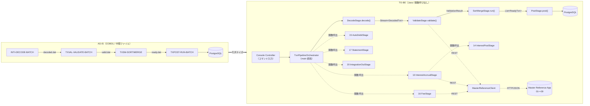
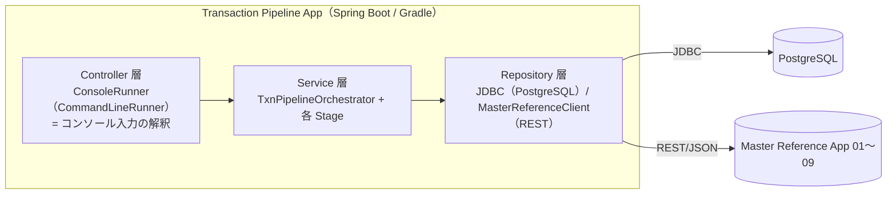
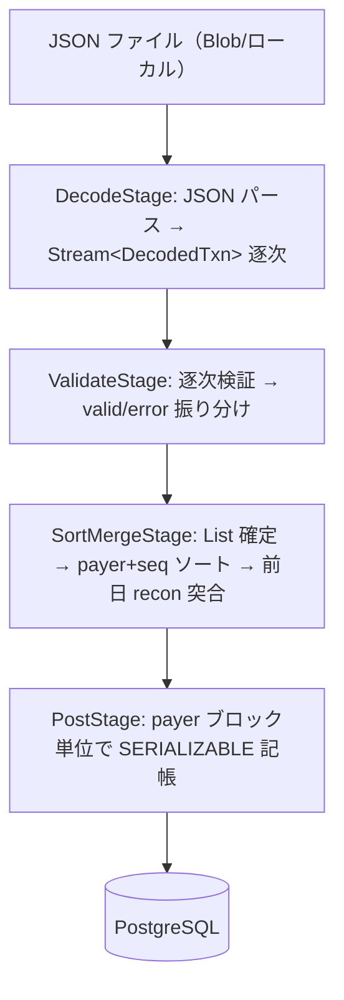

# TO-BE 横断設計書 — 取引パイプライン一気通貫アプリケーション（19→10→11→12 + 13–17/20）

> **位置づけ**: COBOL の取引パイプライン（コア 4 サブシステム 19-integrationin / 10-txnvalidate / 11-txnsortmerge / 12-txnpost）を **1 本の Spring Boot コンソールアプリケーション**として一気通貫で実行する TO-BE 全体設計。
> さらに、コア記帳（12）の後段に位置する **13-interestaccrual / 14-interestpost / 15-autodebit / 16-fee / 17-statement / 20-integrationout** を、同一プロセスの **main 処理から関数呼び出し**で起動できる構成とする。
> 本アプリがマスタ参照系（01〜09）の機能を使う場合は、[architecutre.md](architecutre.md) に沿って **Master Reference App への同期 REST 呼び出し**に置き換える（§2.6）。
> **入力データは JSON 形式のファイル**で受領する前提とする。旧 EBCDIC 固定長からの JSON 変換は上流系の責務であり、本アプリの範囲外（今回未実装）。
> 各サブシステムの詳細は [19](19-integrationin-design.md) / [10](10-txnvalidate-design.md) / [11](11-txnsortmerge-design.md) / [12](12-txnpost-design.md) を参照。
> AS-IS 仕様は [specs-asis/02-transaction-pipeline.md](../specs-asis/02-transaction-pipeline.md)、アプリ分割方針は [architecutre.md](architecutre.md) を一次情報とする。

---

## 基本情報

| 項目 | 内容 |
|---|---|
| 設計書名 | `99-pipeline-orchestration`（機能横断） |
| 対象サブシステム（コアパイプライン） | `19-integrationin` → `10-txnvalidate` → `11-txnsortmerge` → `12-txnpost` |
| 対象サブシステム（拡張・main から関数呼出） | `13-interestaccrual` / `14-interestpost` / `15-autodebit` / `16-fee` / `17-statement` / `20-integrationout` |
| 分類 | トランザクション処理系（バッチパイプライン） |
| 実装言語 | Java 21 / Spring Boot 3（Spring Batch は任意。本設計は素の Service 合成を基本とする） |
| アプリ形態 | **Spring Boot コンソールアプリ**（3 層：Controller = コンソール / Service = ステージ / Repository = PG + REST） |
| ビルド | **Gradle** |
| 入力データ | **JSON 形式のファイル**（業務日単位のバッチ）。上流系での JSON 生成（旧 EBCDIC からの変換等）は本アプリの範囲外＝今回未実装 |
| 記帳先 DB | PostgreSQL 15（`transactions` / `postings` / `balances` / `audit_outbox` ほか）— Transaction Pipeline App 側 |
| マスタ参照 | Master Reference App へ **同期 REST/JSON**（[architecutre.md](architecutre.md) §3） |
| 作成日 | 2026-06-30 |
| ステータス | 起草 |

---

## 1. 設計の狙いと最大の転換点

### 1.1 狙い

AS-IS では 19→10→11→12 が**独立した COBOL プログラム**で、各段が**中間ファイル**（`decoded.dat` → `valid.dat` → `sorted.dat` → `ready.dat`）を介してバトンを渡していた。TO-BE では、これらを**単一 Java プロセス内の関数呼び出し**に置き換え、中間ファイルを**インメモリのドメインオブジェクト受け渡し**に変える。



> コア（19→10→11→12）は **逐次パイプライン**、13–17・20 は **オーケストレータ main からの関数呼び出し**（コンソール指定のコマンドで実行有無を制御。§2.4）。マスタ参照は **REST**（§2.6）。

### 1.2 最大の転換点（中間ファイル → インメモリ）

| AS-IS 中間ファイル | レコード定義（AS-IS） | TO-BE のドメイン型 |
|---|---|---|
| `decoded.dat`（600byte H/D/T） | [shared/copy/ws-txn-decoded-record.cpy](../../../shared/copy/ws-txn-decoded-record.cpy) | `DecodedBatch{ header, Stream<DecodedTxn>, trailer }` |
| `valid.dat` / `error.dat` | [10/copy/private/fd-txn-valid.cpy](../../../subsystems/10-txnvalidate/copy/private/fd-txn-valid.cpy) | `ValidationResult{ List<ValidTxn>, List<TxnError> }` |
| `sorted.dat` → `ready.dat` | [11/copy/private/fd-txn-ready.cpy](../../../subsystems/11-txnsortmerge/copy/private/fd-txn-ready.cpy) | `List<ReadyTxn>`（payer+seq 昇順） |
| `recon-prev`（前日 ready） | [11/copy/private/fd-txn-recon-prev.cpy](../../../subsystems/11-txnsortmerge/copy/private/fd-txn-recon-prev.cpy) | PG テーブル `daily_ready`（後述 §6-B） |

---

## 2. パイプライン・コンポーネント設計

### 2.1 ステージ・インターフェース

各 COBOL プログラムは 1 つの「ステージ」Service にマッピングする。戻り値の COBOL ステータス（`00/04/08/12/16`）は、**カウンタ付き結果オブジェクト + 致命系は例外**へ変換する（§4）。

ステージは目的の違いで 2 系統に分ける。

- **コアパイプライン段**（19→10→11→12）: 前段の出力を次段の入力に渡す `PipelineStage<I,O>`（型付き・逐次）。
- **拡張バッチ段**（13–17, 20）: 入出力は PG 状態（残高・取引）と業務日であり、ストリームを連鎖しない。`BatchStage` として `BatchContext` を受け取り `StageResult<BatchCounters>` を返す（§2.4）。

```java
// コアパイプライン段（前段→後段に値を渡す）
public interface PipelineStage<I, O> {
    StageResult<O> execute(I input, BatchContext ctx);
}

// 拡張バッチ段（PG 状態 + 業務日に対して動作、main から関数呼び出し）
public interface BatchStage {
    StageResult<BatchCounters> execute(BatchContext ctx);
}

// 段ごとの具象（コア）
DecodeStage     implements PipelineStage<DecodeRequest,  DecodedBatch>
ValidateStage   implements PipelineStage<DecodedBatch,   ValidationResult>
SortMergeStage  implements PipelineStage<ValidationResult, SortMergeResult>
PostStage       implements PipelineStage<SortMergeResult, PostResult>

// 段ごとの具象（拡張）
InterestAccrualStage  implements BatchStage  // 13 IACR-RUN-DAILY
InterestPostStage     implements BatchStage  // 14 IPST-RUN-MONTHEND
AutoDebitStage        implements BatchStage  // 15 AD-RUN-DAILY
FeeStage              implements BatchStage  // 16 FEE-CHARGE
StatementStage        implements BatchStage  // 17 STMT-GENERATE-BATCH
IntegrationOutStage   implements BatchStage  // 20 INTO-PUBLISH-EVENT / DRAIN
```

### 2.2 オーケストレータ

AS-IS の `OPS-BATCH-DAILY`（[22-operations](../specs-asis/03-operations-audit.md)）の役割を Java の `TxnPipelineOrchestrator` が担う。各ステージの戻りステータスで**継続 / 中断**を判定する（AS-IS の `RUN-PIPELINE` の `IF WS-STEP-RC NOT = 0 → HALT` を踏襲）。**コアパイプラインを実行後、コンソールで指定された業務コマンドに応じて 13–17・20 を関数呼び出し**する。

```java
@Service
public class TxnPipelineOrchestrator {

    // コアパイプライン（19→10→11→12）。前段の出力を後段へ渡す
    PostResult runCore(DecodeRequest req, BatchContext ctx) {
        var decoded   = decodeStage.execute(req, ctx).orThrowOnFatal();
        var validated = validateStage.execute(decoded.value(), ctx).orThrowOnFatal();
        var merged    = sortMergeStage.execute(validated.value(), ctx).orThrowOnFatal();
        return postStage.execute(merged.value(), ctx).orThrowOnFatal().value();
    }

    // main 統括：コア実行後、コマンドに応じて拡張段を「関数呼び出し」で連鎖
    PipelineOutcome run(PipelineCommand cmd, BatchContext ctx) {
        var core = runCore(cmd.decodeRequest(), ctx);
        var agg  = PipelineOutcome.of(core);

        if (cmd.runInterestAccrual())  agg.add(interestAccrualStage.execute(ctx)); // 13
        if (cmd.runInterestPost())     agg.add(interestPostStage.execute(ctx));    // 14（月末）
        if (cmd.runAutoDebit())        agg.add(autoDebitStage.execute(ctx));       // 15
        if (cmd.runFee())              agg.add(feeStage.execute(ctx));             // 16
        if (cmd.runStatement())        agg.add(statementStage.execute(ctx));       // 17
        if (cmd.runIntegrationOut())   agg.add(integrationOutStage.execute(ctx));  // 20

        return agg.build();
    }
}
```

> 拡張段は**それぞれ独立した関数呼び出し**であり、`PipelineCommand` のフラグ（コンソール入力に由来）で実行有無を制御する。これにより「日次（13/15/16/17/20）」「月末（14）」など AS-IS の systemd timer 別起動を、1 プロセス内のコマンド分岐で再現する。

### 2.3 ステージ境界とエラー伝播

| 境界 | 受け渡し | 中断条件（AS-IS 準拠） |
|---|---|---|
| 19→10 | `DecodedBatch`（H/D/T） | 19 が `08/12/16` → パイプライン中断。`01`(入力未着)→正常終了（no-op） |
| 10→11 | `ValidationResult`（valid のみ後段へ） | 10 が `08/12/16` → 中断。`04`(一部却下)→ valid 分のみ継続 |
| 11→12 | `List<ReadyTxn>` | 11 が `08/12/16` → 中断。`04`(重複検出)→ ready 分のみ継続 |
| 12→終了 | `PostResult` | 12 が `12/16` → 異常終了。`04`(一部 defer)→ defer 分を再投入キューへ |

### 2.4 拡張バッチ段（13–17・20）の関数呼び出し

コア記帳（12）が当日の `transactions`/`balances` を確定した後、`TxnPipelineOrchestrator` は以下の拡張段を **同一プロセス内の関数呼び出し**で順次起動する。各段は AS-IS では独立 COBOL かつ別 systemd timer 起動だが、TO-BE では `BatchStage.execute(ctx)` の呼び出しに統一する。

| 段 | TO-BE ステージ（関数） | AS-IS プログラム | 入力 | 主な副作用 | マスタ参照（REST, §2.6） | 実行契機（コマンド） |
|---|---|---|---|---|---|---|
| 13 | `InterestAccrualStage.execute(ctx)` | `IACR-RUN-DAILY` | 業務日・`balances` | `interest_accruals` INSERT(`AC`) | 商品（利息対象）/ 金利 | 日次 |
| 14 | `InterestPostStage.execute(ctx)` | `IPST-RUN-MONTHEND` | 月末日・`interest_accruals(AC)` | category=50 記帳・`PT` 更新 | 商品 | 月末のみ |
| 15 | `AutoDebitStage.execute(ctx)` | `AD-RUN-DAILY` | 業務日・`autodebit_schedules` | category=20 記帳・停止/解約更新 | 口座状態 | 日次 |
| 16 | `FeeStage.execute(ctx)` | `FEE-CHARGE` | 当日 `transactions(PT)` | category=60 記帳 | 手数料体系 | 日次 |
| 17 | `StatementStage.execute(ctx)` | `STMT-GENERATE-BATCH` | `postings`/`transactions` | 明細ファイル出力（DB 更新なし） | 顧客名・支店名 | 日次/月次 |
| 20 | `IntegrationOutStage.execute(ctx)` | `INTO-PUBLISH-EVENT` / `DRAIN` | `audit_outbox` 相当 | イベント発行（外部 MQ/Service Bus） | なし | 日次 |

- **記帳系（13/14/15/16）** は 12 と同じ複式記帳基盤（`@Transactional(SERIALIZABLE)` + `DOUBLE-ENTRY-HELPER` 相当 + アウトボックス）を共用する（§5）。これらは**副作用あり**で、コア段（19/10/11）の「純粋変換」とは区別する。
- **依存順序**: 14 は 13 の `AC` 行を前提とするため `13 → 14` の順序を守る。20 は 12/13–16 の記帳で生成された `audit_outbox` を最後にドレインする。
- 各段は独立に成否を返すため、ある拡張段が `08/12/16` でもコア記帳（確定済）はロールバックしない。オーケストレータは `PipelineOutcome` に各段のカウンタ/ステータスを集約し、コンソールへ要約を返す。

### 2.5 コンソール・コントローラと 3 層アーキテクチャ

本アプリは [architecutre.md](architecutre.md) の Transaction Pipeline App に該当し、3 層構成の **Controller をコンソール**とする。コンソールからの入力（業務日・バッチ ID・実行コマンド）を `PipelineCommand` に解釈し、Service 層（オーケストレータ/各ステージ）へ委譲する。



| 層 | 役割 | 主なクラス（例） |
|---|---|---|
| Controller（コンソール） | 標準入力/引数の解釈、コマンド分岐、結果表示。AS-IS の `oper-console`/`OPS-BATCH-DAILY` の対話・起動相当 | `ConsoleRunner implements CommandLineRunner`、`PipelineCommandParser` |
| Service（ステージ） | コア/拡張ステージのビジネスロジック | `TxnPipelineOrchestrator`、`DecodeStage`〜`IntegrationOutStage` |
| Repository | 記帳系 DB アクセス（JDBC）とマスタ参照（REST） | `PostingRepository`、`BalanceRepository`、`MasterReferenceClient`（§2.6） |

**コンソール入力例（イメージ）**:

```text
> run-daily   --batch-id JSON20260630-01 --business-date 20260630 --input /data/in/txn.json
> run-monthend --business-date 20260630          # 14 を含む月末コマンド
> statement   --mode M --business-date 20260630  # 17 のみ実行
```

`ConsoleRunner` はこれらを `PipelineCommand`（業務日・バッチ ID・入力パス・各拡張段の実行フラグ）に変換し、`orchestrator.run(cmd, ctx)` を 1 回呼ぶ。Spring Boot は Web サーバを起動しない（`spring.main.web-application-type=none`）バッチ/コンソール構成とする。

### 2.6 マスタ参照（Master Reference App への REST 連携）

AS-IS では各段が **ISAM 由来のメモリキャッシュ**（カレンダー/支店/商品/金利/手数料/口座）でマスタを参照していた。TO-BE では [architecutre.md](architecutre.md) の方針に従い、これらを **Transaction Pipeline App → Master Reference App の同期 REST/JSON 呼び出し**へ置き換える。マスタテーブル（ISAM 含む）は Master Reference App 側 RDBMS に集約され、本アプリは DB を直接参照しない。

```java
// Repository 層：マスタ参照は REST クライアントに集約（Feign / RestClient いずれか）
public interface MasterReferenceClient {
    BusinessCalendar getBusinessCalendar(LocalDate date);   // GET /api/v1/business-calendar/{date}
    Branch          getBranch(String branchCode);           // GET /api/v1/branches/{branchCode}
    Product         getProduct(String productCode);         // GET /api/v1/products/{productCode}
    InterestRate    getInterestRate(String rateCode);       // GET /api/v1/interest-rates/{rateCode}
    FeeSchedule     getFeeSchedule(String feeCode);         // GET /api/v1/fee-schedules/{feeCode}
    Account         getAccount(String accountNo);           // GET /api/v1/accounts/{accountNo}
    Customer        getCustomer(String customerId);         // GET /api/v1/customers/{customerId}
}
```

**どの段がどのマスタ API を使うか**（AS-IS のマスタ照合に対応）:

| 段 | 用途（AS-IS） | 置換後の REST エンドポイント |
|---|---|---|
| 10 ValidateStage | 営業日判定（E012）/ 支店存在（E014）/ 商品存在・有効期間（E015/E016） | `GET /api/v1/business-calendar/{date}`、`GET /api/v1/branches/{code}`、`GET /api/v1/products/{code}` |
| 13 InterestAccrualStage | 利息対象商品判定・金利参照 | `GET /api/v1/products/{code}`、`GET /api/v1/interest-rates/{rateCode}` |
| 14 InterestPostStage | 商品適格性 | `GET /api/v1/products/{code}` |
| 15 AutoDebitStage | 口座状態（有効/停止/解約） | `GET /api/v1/accounts/{accountNo}` |
| 16 FeeStage | 手数料体系（区分/金額→tier） | `GET /api/v1/fee-schedules/{feeCode}` |
| 17 StatementStage | 顧客名・支店名 | `GET /api/v1/customers/{customerId}`、`GET /api/v1/branches/{code}` |

**性能・整合の方針**:

- AS-IS のメモリキャッシュ挙動を踏襲し、**バッチ開始時に営業日・支店・商品など更新頻度の低いマスタを一括取得してローカルキャッシュ**（`Map`）に載せ、明細処理ではキャッシュ参照とする（取引 1 件ごとの HTTP 往復を避ける）。口座状態など鮮度が要るものは都度取得。
- REST 呼び出しは**読み取り専用**であり、本アプリの記帳トランザクション（§5）の外側で行う。マスタ App 障害時は段の戻り値を `12`(I/O 失敗) 相当として中断する（[architecutre.md](architecutre.md) の同期 HTTP 前提）。

### 2.7 アプリケーション構成（Gradle / Spring Boot）

| 項目 | 内容 |
|---|---|
| ビルドツール | Gradle（`build.gradle` / `settings.gradle`、Spring Boot Gradle Plugin で実行可能 Jar 生成） |
| 主要依存 | `spring-boot-starter`（Web は不要＝`web-application-type=none`）、`spring-boot-starter-jdbc`、`spring-retry`、PostgreSQL JDBC、REST クライアント（`spring-cloud-starter-openfeign` または `RestClient`） |
| エントリポイント | `@SpringBootApplication` + `ConsoleRunner implements CommandLineRunner`（Web サーバを起動しないコンソール常駐/バッチ） |
| 設定 | `application.yml`：DB 接続、Master Reference App のベース URL、リトライ係数（§5）、`spring.main.web-application-type=none` |
| 実行 | `./gradlew bootRun --args='run-daily --batch-id ... --business-date ...'` もしくは `java -jar app.jar <command> ...` |

---

## 3. データフロー（インメモリ）と保存則

### 3.1 流量モデル

大量バッチを考慮し、**19→10 は `Stream`/`Iterator` 逐次**、**11 は payer+seq ソートのため一旦 `List` に確定**（ソートは全件メモリ必要）、**12 は payer 口座ブロック単位でコミット**する。



### 3.2 引き継ぐ不変条件（保存則）

AS-IS が各段で検証している保存則は TO-BE でも**ステージ境界アサーション**として維持する。

| 不変条件 | AS-IS 検証箇所 | TO-BE 維持方法 |
|---|---|---|
| 件数保存（無損失） | 11 `VERIFY-LOSSLESS-INVARIANT` | `assert in.count == out.count + rejected` |
| コントロールトータル（金額合計） | 10/11 トレーラ照合 | header `expectedCount` / trailer `amountSum` を `BatchContext` で突合 |
| 借方=貸方 | 12 `check-postings-sum.sh` | 記帳トランザクション内で DR 合計 = CR 合計 を検証 |
| 冪等性（重複なし） | 12 I1 / 11 重複検出 | 12 の `txn_id` 一意制約に集約（§6-A） |

---

## 4. ステータス → Java 例外・結果モデル

COBOL の数値ステータスを、**回復可能（結果オブジェクト）** と **致命（例外）** に二分する。

| COBOL | 意味 | TO-BE 表現 |
|---|---|---|
| `00` | 正常 | `StageResult.ok(value, counters)` |
| `01` | 入力未着（19のみ） | `StageResult.noInput()` → パイプライン正常終了 |
| `04` | 一部却下 / defer | `StageResult.partial(value, counters)`（後段は有効分のみ継続） |
| `08` | 入力不正 | `InvalidInputException`（中断、リトライ不可） |
| `12` | I/O 失敗 | `IoFailureException`（中断、運用リトライ対象） |
| `16` | 致命的 | `FatalPipelineException`（中断、要調査） |

```java
public record StageResult<T>(Status status, T value, Counters counters) {
    enum Status { OK, NO_INPUT, PARTIAL, INVALID, IO_FAIL, FATAL }
    T orThrowOnFatal() { /* INVALID/IO_FAIL/FATAL は例外送出 */ }
}
```

---

## 5. トランザクション境界とアウトボックス

- **コア段 19/10/11 は副作用なし（純粋変換）**。コアパイプラインでの DB 書き込みは段 12 のみ。
- **拡張記帳系（13/14/15/16）は副作用あり**（§2.4）。いずれも 12 と同一の複式記帳基盤（`@Transactional(SERIALIZABLE)` + アウトボックス）を共用し、記帳単位でコミットする。17 は出力のみ（DB 更新なし）、20 はアウトボックスのドレイン。
- **段 12 のコミット単位は「payer 口座ブロック」**（AS-IS `OPEN-ACCT-BLOCK` 準拠）。1 取引ペア（DR/CR 2 行 + balances 2 更新 + outbox 1 行）を `SERIALIZABLE` で記帳。
- **トランザクショナル・アウトボックス**は AS-IS をそのまま継承：記帳と同一トランザクションで `audit_outbox` に intent を INSERT し、別ドレイン処理が冪等転送（`event_key = MD5(txn_id||posting_id)`）。
- **マスタ参照の REST 呼び出しは記帳トランザクションの外側**で行う（§2.6）。外部呼び出しを DB トランザクションに含めない。

```java
@Transactional(isolation = Isolation.SERIALIZABLE)
@Retryable(retryFor = SerializationFailureException.class,
           maxAttempts = 5, backoff = @Backoff(delay = 10, multiplier = 2, maxDelay = 2000))
public void postPair(ReadyTxn txn, BatchContext ctx) { ... }
```

---

## 6. 横断的な未解決論点と既定方針

| # | 論点 | 既定方針（推奨） | 代替案 |
|---|---|---|---|
| A | 一気通貫時の **checkpoint/recover**（10）。JVM 内では中間状態が揮発する | **再実行時の冪等は 12 の `txn_id` 一意制約（I1）に集約**し、19/10/11 は再計算で割り切る。10 の `.ckpt` は廃止 | 各ステージ結果を一時テーブルに永続し中断再開 |
| B | 11 の **前日 recon 突合データの所在**。AS-IS は前日 `ready.dat` を参照 | 前日確定分を **PG テーブル `daily_ready`（business_date, payer_acct, seq, ...）に永続**し、当日突合はこれを読む | 前日 `ready` をファイルとして保管し読み込む |
| C | **バッチ流量**（全件メモリ vs 逐次） | 19→10 は `Stream` 逐次、11 のソートのみ `List` 確定、12 は口座ブロック単位コミット | 全段 Spring Batch チャンク処理に委譲 |
| D | **入力フォーマット**（19）。AS-IS は EBCDIC 固定長を C util（CP930→UTF-8）で変換 | **入力は JSON 形式**を前提とし、`DecodeStage` は JSON を Jackson 等でパースしてドメイン型（`DecodedTxn`）へマッピングする。EBCDIC デコードは廃止し、JSON 生成は上流系の責務（本アプリ範囲外・未実装） | 旧 EBCDIC を継続受領する場合は別途デコード段を追加 |
| E | **多重起動防止**（AS-IS `flock`） | DB アドバイザリロック（`pg_advisory_lock`）or `batch_run` テーブルの一意制約で代替 | 実行基盤側（K8s Job 同時実行数=1） |

---

## 7. デプロイ形態（TO-BE 実行基盤）

| AS-IS | TO-BE |
|---|---|
| systemd timer（23:00 JST） | Container Apps Jobs（cron）/ K8s CronJob（コンソールコマンドを引数で渡す） |
| `OPS-BATCH-DAILY`（COBOL 統括） | `TxnPipelineOrchestrator` + `ConsoleRunner`（Spring `CommandLineRunner`、Gradle 生成 Jar） |
| ISAM マスタ（calendar/branch/product ほか） | **Master Reference App へ REST**（§2.6）。本アプリはマスタ DB を直参照しない |
| systemd timer 別起動（日次/月末/再試行） | 1 プロセス内のコマンド分岐（`run-daily`/`run-monthend` 等、§2.5）で拡張段を関数呼び出し |
| RabbitMQ `pb.events` | （本パイプライン内の 20-integrationout が関数呼び出しで担当）Service Bus |

---

## 8. 未解決事項

| # | 項目 | 対応方針 | 担当 | 期限 |
|---|---|---|---|---|
| 1 | `daily_ready` テーブルの DDL 追加（論点 B） | Flyway V8 として追加要否を判断 | — | — |
| 2 | マスタ参照を REST 一括取得＋起動時キャッシュとする範囲（§2.6） | 更新頻度・データ規模で都度取得/キャッシュを段別に決定 | — | — |
| 3 | Spring Batch 採用可否（論点 C） | 流量試験後に判断 | — | — |
| 4 | 支店参照 API（`GET /api/v1/branches/{code}`）の Master Reference App 側提供（§2.6） | [architecutre.md](architecutre.md) 代表 API に未掲載のため追加要否を確定 | — | — |
| 5 | 拡張段（13–17, 20）のコマンド体系（日次/月末/個別実行）の確定（§2.5） | `PipelineCommand` のフラグ設計とコンソール引数仕様をレビュー | — | — |
| 6 | マスタ App 障害時の段の扱い（中断/部分継続） | REST 失敗を `12`(I/O) 相当とする方針をレビューで確定（§2.6） | — | — |

---

*参照: [specs-asis/02-transaction-pipeline.md](../specs-asis/02-transaction-pipeline.md) / [architecutre.md](architecutre.md) / [doc/work/modernization-brief.md](../../work/modernization-brief.md) / テンプレート doc/design/templates/subsystem-design-template.md*
