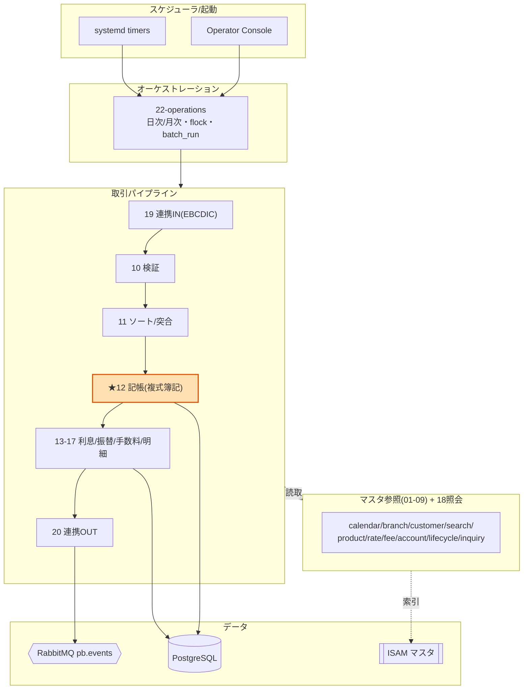
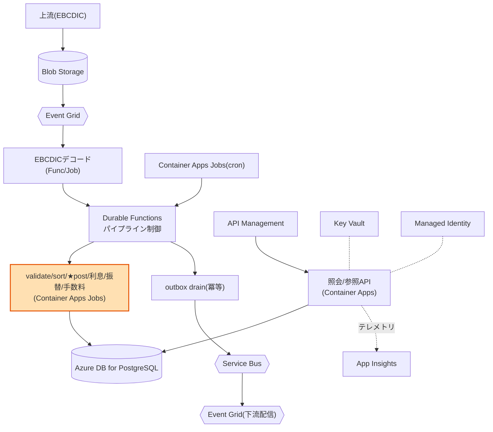
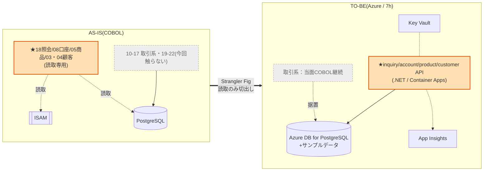

# COBOL レガシーモダナイゼーション — チーム共有ブリーフ

**対象**: `legacy-modernization-ws-cobol-260630`（GitHub Copilot Quest Lv.3）
**制約**: 7時間 / 5名体制
**結論**: 全体移行は不可能。**読み取り専用スライス4本**を Azure ネイティブで作り直す「縦に薄く1本通す」を並列で量産する。記帳系には触らない。

---

## 1. これは何のシステムか

架空のリテール銀行「practice-bank」の**勘定系バッチシステム**。ワークショップ用にドキュメント・コメントだけ意図的に剥がされている（コード・スキーマ・テストは一次情報として有効）。

- 技術: **GnuCOBOL**（埋め込みSQLは **OCESQL**）+ **PostgreSQL 15** + **RabbitMQ**
- マスタは **ISAM**、取引は **PostgreSQL**、スキーマは **Flyway**(V1–V7)、定期実行は **systemd timer**、開発は **Dev Container**
- ファイル種別: `.sqb`=埋め込みSQL / `.cob`=純COBOL / `.cpy`=コピーブック
- **22サブシステム** + 共有ユーティリティで構成

### ドメインモデル
- マスタ系: 顧客・口座・支店・商品・カレンダー・金利・手数料体系
- 取引系: transactions / **postings（複式簿記の借方・貸方）** / balances / interest_accruals / autodebit_schedules / batch_run / audit_log・audit_outbox
- 通貨はJPY固定・金額は整数（円）。取引区分 **10=入金/20=出金/30=振替/40=仕向送金/50=利息/60=手数料**

### 設計上の堅牢化（クラウドでも活きる資産）
トランザクショナル・アウトボックス（記帳と同一Txで監査intentを書き、`aud-drain`が冪等転送）、`event_key`による冪等性、チェックポイント/リカバリ、リトライ、`flock`による二重起動防止、口座の休眠ライフサイクル、監査ログのパーティショニング。

---

## 2. As-Is 全体構成



3層構造: **01–09 マスタ参照** / **10–17・19・20 取引本流** / **21・22 運用・監査**。

---

## 3. 22サブシステム一覧（役割・データの扱い）

データの扱いは3パターン: **ISAMマスタ系**(`.cob`+`.dat`) / **ファイル処理系**(`.cob`+中間ファイル) / **PostgreSQL系**(`.sqb`)。

| # | サブシステム | 役割 | データ |
|---|---|---|---|
| 01 | calendar | 営業日/祝日判定・翌前営業日 | ISAM |
| 02 | branch | 支店マスタ参照 | ISAM |
| 03 | customer | 顧客参照・カナ/電話検索・状態変更 | ISAM |
| 04 | customersearch | 顧客複合検索(AND/住所/ページング) | 03データ上で検索 |
| 05 | product | 商品マスタ参照 | ISAM |
| 06 | interestrate | 金利マスタ(適用日別) | ISAM |
| 07 | feeschedule | 手数料体系(区分/tier別) | ISAM |
| 08 | account | 口座参照・存在確認・休眠日更新 | ISAM |
| 09 | accountlifecycle | 開設・状態変更・休眠/再活性スキャン | account状態更新 |
| 10 | txnvalidate | 取引検証 + checkpoint/recover | ファイル |
| 11 | txnsortmerge | ソート + 前日突合(recon) | ファイル |
| 12 | **txnpost** | **★複式簿記 記帳・残高・取消** | **PostgreSQL** |
| 13 | interestaccrual | 利息計算(日次) | PostgreSQL |
| 14 | interestpost | 利息計上(月末) | PostgreSQL |
| 15 | autodebit | 口座振替(日次)・retry | PostgreSQL |
| 16 | fee | 手数料徴収・retry | PostgreSQL |
| 17 | statement | 明細書生成 | PostgreSQL→出力 |
| 18 | inquiry | 残高・履歴 照会(読取専用) | PostgreSQL |
| 19 | integrationin | EBCDIC→ASCIIデコード | ファイル |
| 20 | integrationout | イベントpublish・outboxドレイン | RabbitMQ |
| 21 | audit | 監査partition rollover・照会 | PostgreSQL |
| 22 | operations | バッチ制御・flock・batch_run・seed | PostgreSQL+shell |

---

## 4. To-Be（理想形 / 将来像）



将来的な対応付け: マスタ/照会→Container Apps API、バッチ→Durable Functions/Container Apps Jobs、RabbitMQ→Service Bus、ISAM/PG→Azure DB for PostgreSQL、ファイル連携→Blob+Event Grid。**既存のアウトボックス+冪等はそのまま継承**。

---

## 5. 今回のスコープ（7時間で到達する姿）

**読み取りスライス4本**＝18照会 / 08口座 / 05商品 / 03・04顧客 を .NET API として Azure に乗せる。**記帳系(12)は不変条件を壊すリスクが高く、今回は触らない（Strangler Fig の第一歩）。**



---

## 6. そもそも「スライス（縦スライス）」とは

**「1つの機能を、入口から出口まで丸ごと通して動かす単位」** のこと。

- **横割り**（NG）: DBを全部 → ロジックを全部 → APIを全部、と層ごとに作る。最後までつながらず、終了間際に事故る。
- **縦スライス**（採用）: 1機能だけ DB→ロジック→API→デプロイまで一気通貫で完成させる。薄くても**端から端まで動く**。

縦スライスの利点は、**1本通った時点で「Azure上で本当に動く」ことが証明される**こと。デプロイ経路・DB接続・データ投入という詰まりやすい所が、最初のスライスで全部潰れる。2本目以降は同じ型のコピーなので速い。

---

## 7. 最初のスライス：口座照会(08-account)の作り方

既存 `acct-api.cpy` から判明した契約: 入力=口座番号(13桁)、出力=口座情報1件＋2桁ステータス。
状態コード `P=申込/A=有効/D=休眠/S=停止/C=解約/R=再活性中`。
**守るべき戻り値**: `00=OK / 04=該当なし / 08=入力不正 / 12=I/O失敗 / 16=致命的`。

| ステップ | 担当 | 内容 |
|---|---|---|
| 1. 契約を起こす | COBOL#1 | COBOL戻り値をHTTPに対応づけ。`GET /accounts/{num}`、`00→200 / 04→404 / 08→400 / 12・16→500`。`docs/specs/account-lookup.md`にコミット |
| 2. ゴールデンケース | COBOL#2 | 既存`accounts-mvp.dat`から「入力→期待レスポンス」を抽出（存在/不存在/桁不正）。PG投入用データdumpも用意 |
| 3. API実装 | .NET#2 | `accounts`テーブルを読む最小API。13桁数字以外は400、無ければ404、あれば200。ローカルでゴールデンケース全一致まで修正 |
| 4. 土台に乗せる | あなた | ACR/Container Apps/PostgreSQL/Key Vault を最小構成で。まず空アプリでデプロイ経路を実証→本物を乗せ公開URL共有 |
| 5. 検証 | 全員 | 公開エンドポイントにゴールデンケースを流し、JSON・ステータスが一致したら完成 |

レスポンス例:
```json
{ "accountNumber":"0000000012345", "custId":"0000000042",
  "productCode":"001", "branchCode":"100",
  "openedDate":"2024-04-01", "status":"A" }
```

API骨子(.NET):
```csharp
app.MapGet("/accounts/{num}", async (string num, NpgsqlConnection db) => {
    if (num.Length != 13 || !num.All(char.IsDigit))
        return Results.BadRequest();        // 08
    var a = await db.QueryAccount(num);
    return a is null ? Results.NotFound()    // 04
                     : Results.Ok(a);        // 00
});
```

**注意（実物で発見）**: ISAMマスタには overdraft（当座貸越枠）や term-days があるが、PostgreSQLの`accounts`テーブルには無く項目がずれている。7時間では「PGにある項目だけ返す」と割り切る。こうした差異の洗い出しがCOBOL#1の役目。

残り3本（05商品・03/04顧客）は、この5ステップの**型をコピーして中身を変えるだけ**。

---

## 8. 役割分担とタイムライン（5名 / 7時間）

| 担当 | 役割 |
|---|---|
| **あなた** | Azure・基盤・デプロイ・監視（全成果物の着地点） |
| **COBOL #1** | 仕様復元 → 契約(OpenAPI雛形)産出。18→08→03/04を先行供給 |
| **COBOL #2** | 既存テスト→ゴールデンケース化、05契約＋サンプルデータ全般 |
| **.NET #1** | 実装。18・05担当。歩く骨格(雛形)も担当 |
| **.NET #2** | 実装。08・03/04担当。共通DBアクセス層/CIテンプレ |

```mermaid
gantt
    title 7時間タイムボックス
    dateFormat HH:mm
    axisFormat %H:%M
    section 全員
    キックオフ(契約形式合意)        :done, k, 00:00, 45m
    予備バッファ＋デモ              :crit, d, 05:45, 75m
    section Azure(あなた)
    基盤プロビジョニング            :a1, 00:45, 60m
    歩く骨格デプロイ実証            :crit, a2, 01:45, 30m
    スライス順次デプロイ＋PG投入     :a3, 02:15, 135m
    結合・監視・公開URL            :a4, 04:30, 75m
    section COBOL#1(仕様)
    18仕様復元→契約                :crit, c1a, 00:45, 75m
    08契約                        :c1b, 02:00, 60m
    03/04契約                     :c1c, 03:00, 90m
    支援・予備                     :c1d, 04:30, 75m
    section COBOL#2(ゴールデン/データ)
    18ゴールデン＋データdump        :c2a, 00:45, 75m
    05契約＋データ                 :c2b, 02:00, 60m
    データ整備・検証補助            :c2c, 03:00, 90m
    突合支援                       :c2d, 04:30, 75m
    section .NET#1
    雛形＋コンテナ化(骨格)          :crit, n1a, 00:45, 60m
    18実装＋一致検証               :n1b, 02:00, 75m
    05実装                        :n1c, 03:15, 75m
    検証・修正                     :n1d, 04:30, 75m
    section .NET#2
    共通土台(DB層/CI)             :n2a, 00:45, 60m
    08実装＋一致検証               :n2b, 02:00, 75m
    03/04実装                     :n2c, 03:15, 75m
    検証・修正                     :n2d, 04:30, 75m
```



---

## 9. 受け渡し物（契約）— キックオフで最初に固定する

- **COBOL → .NET**: 仕様メモ + OpenAPI雛形 + ゴールデンケース(input→expected JSON) + サンプルデータdump
- **.NET → Azure**: コンテナイメージ + 必要なenv/secret一覧
- **Azure → 全員**: 公開エンドポイントURL + 接続情報(Key Vault経由)

この3点が決まっていれば、各トラックは相手の完成を待たずに進められる。

---

## 10. リスクと鉄則

- **歩く骨格を2時間以内に通す。** 空アプリのデプロイ経路を最初に実証する（最大の保険）。
- スコープは**読み取り専用に限定**。記帳・利息・振替(12–16)は触らない。
- Azureは**サービス数を絞る**（Service Bus・Event Grid・Durable Functions・APIMは今回不要）。
- COBOLペアが常に**半歩先行**し、.NETの供給を切らさない。
- 各スライスは独立。1本詰まっても他は進む構成を保つ。
- 行き詰まったら**ローカルで動くもの優先**、Azureデプロイは最後の30分でも成立する形に。

---

## 11. スコープ外と次の一手

今回触らない取引系(10–17)・運用監査(19–22)は当面COBOL継続。デモの締めは「読取スライスを剥がせた」実績と、**Strangler Fig で記帳系へどう広げるか**のロードマップで締める。`.github/copilot-instructions.md` に「複式簿記の勘定系/円・整数/対象スライスは読取専用」を書いておくと全工程でCopilotの精度が上がる。
